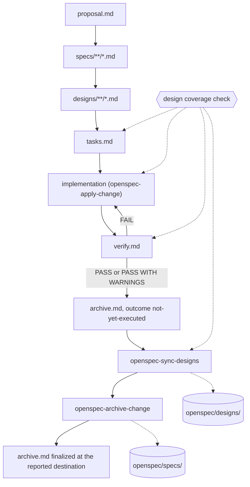

# super-sdd

A custom OpenSpec workflow with adaptive design documents, durable design sync, and evidence gates.
Version 1.11.0.12: revision 12, checked against OpenSpec CLI 1.11.0 and compatible with 1.11.x.



`openspec-continue-change` creates the next artifact; `openspec-propose` prepares implementation
prerequisites. The design artifact is a set of files rather than a fixed document list, which is why
the coverage check hangs off four points: OpenSpec marks `designs/**/*.md` done as soon as one
matching file exists, so it can never tell you the set is complete. The check is agent-enforced, not
CLI validation, and it stops the next phase on missing or unlisted files, unfinished content, broken
design links, or conflicting destinations.

Apply reads every design file and tracks tasks.md. The archive operation guidance in
`openspec/config.yaml` coordinates the last three steps, and the sync skill also runs on its own when
explicitly requested.

Two rules the arrows understate. A prepared archive.md is not proof of execution, and you never
archive after a failed or incomplete sync, because OpenSpec's own archive does not merge designs.

## Install

Prerequisites: OpenSpec CLI 1.11.x, plus the Superpowers skills for brainstorming, writing plans,
subagent-driven development, and verification. Those four are binding, so the relevant phase stops if
its skill is unavailable. Companion skills support TDD, worktrees, review, and debugging.

```toml
[tools]
"github:rayjp2010/super-sdd" = "1.11.0.12"
```

```bash
mise install
super-sdd install
```

`super-sdd install` does the rest: it pins and installs the OpenSpec CLI this revision targets, runs
`openspec init` when `openspec/` is missing, and then copies itself in. It runs the CLI through
`mise exec`, so it works even when a bare `openspec` is a shim with no active version. Pass
`--tools <list>` to choose what `openspec init` sets up (default `claude`), or `--no-init` to require
an existing `openspec/`.

That leaves the project holding:

```
your-project/
  mise.toml                                openspec pin refreshed to match the installed revision
  openspec/config.yaml                     replaced only when untouched since openspec init
  openspec/schemas/super-sdd/              schema.yaml and the six templates
  .agents/skills/openspec-sync-designs/    the project's one copy of the sync skill
  .claude/skills/openspec-sync-designs     symlink to it, when the tool uses .claude/skills
```

The mirror only appears when the chosen tool writes `.claude/skills`, so `--tools agents` leaves no
`.claude` directory behind. A config.yaml carrying real project settings is left alone, and you merge
its `context` and `operations` blocks yourself. Nothing else is overwritten without `--force`, which
is also how you re-run the installer after `mise up`. `--no-openspec` leaves `mise.toml` alone. When
mise is missing or refuses to edit an untrusted config, the installer prints the `mise use` line to
run and carries on. Without mise entirely, run `bin/super-sdd install` from a clone.

Use the CLI-generated OpenSpec skills rather than copying their implementations from another project,
and run everything from the project root. Outside a project that pins the CLI, where mise may hold
openspec with no active version, use `mise exec npm:@fission-ai/openspec@1.11.0 -- openspec ...`
instead of changing global settings.

```bash
openspec schema validate super-sdd --verbose         # after installing
openspec templates --schema super-sdd
openspec new change <change-id> --schema super-sdd

openspec status --change <change-id> --json          # inspecting a change in flight
openspec instructions design --change <change-id> --json
openspec instructions apply --change <change-id> --json
openspec validate <change-id> --type change --strict --json
```

## Versioning

Releases are `<openspec-version>.<super-sdd-revision>`: the OpenSpec CLI version this workflow was
checked against, then the workflow's own revision. `1.11.0.12` is revision 12 checked against OpenSpec
1.11.0, and the next revision is 1.11.0.13. Checking against a newer OpenSpec release moves the first
three fields while the revision carries on. Shorter pins take the newest release under that prefix,
so `= "1.11.0"` follows revisions for that OpenSpec release and `= "1.11"` follows the series.

`VERSION` is the source of truth: four numeric fields, last field equal to `version:` in
`openspec/schemas/super-sdd/schema.yaml`, tag equal to `v$(cat VERSION)`. The release workflow
refuses to publish otherwise, then attaches a `git archive` tarball to a GitHub release.

## Adaptive designs

The proposal's Design Documents table inventories change-local paths, purposes, and durable targets,
and that inventory is the coverage contract. Pick the smallest useful set. These are examples, not
presets:

| Change | Possible change-local documents |
|---|---|
| Small refactor or docs change | designs/overview.md |
| Web checkout change | designs/checkout-ui.md, designs/payment-api.md |
| Batch ingestion change | designs/ingestion.md, designs/recovery.md |
| Multiple applications | designs/web/session.md, designs/api/authorization.md |

Every document uses the same small template. `CONTEXT` holds change-local decisions and alternatives.
`Durable Design: openspec/designs/<target>` sections carry the ADDED/MODIFIED/REMOVED content that
sync merges before archive. One document may own several destinations, but a destination has exactly
one owner per change, so cross-reference related documents instead of repeating decisions, and update
the inventory when the split changes. A document with no durable destination keeps brief context plus
the explicit `No durable design impact.` line.

Paths inside a change start from the CLI-reported `changeRoot`. Durable targets start from
`planningHome.root` and stay inside its `openspec/designs/` tree; archive paths start from
`planningHome.changesDir`. Use `artifactPaths.design.existingOutputPaths` for discovery, and read
every path in apply `contextFiles`.

## Upgrade existing projects

Bump the pin in `mise.toml`, then run `mise install && super-sdd install --force`. That replaces the
schema and sync skill together. Merge revised config guidance by hand, since an edited
`openspec/config.yaml` is never overwritten. The revision number is informational and does not pin
older changes to an older copy of the schema.

For each active legacy change:

1. Resolve `changeRoot` through status JSON. Move its design.md to designs/overview.md inside that
   root, preserving all context and durable delta sections. Split it further only when useful.
2. Replace Durable Design Impact in the proposal with Design Documents, listing every local document
   and its destinations. Use `none` for an explicit no-impact document.
3. Update design links in tasks and other artifacts, then re-run coverage and verification.

The sync skill still reads a legacy-only design.md and its old proposal section, but under the
current schema that file alone no longer completes the design artifact. Migrate before continuing,
reconcile both layouts if both exist, and leave archived changes untouched.

## Maintaining the schema

Templates define document structure and schema instructions define workflow rules. Project `context`
is injected into artifact instructions, `rules` adds per-artifact guidance, and `operations` supplies
apply and archive guidance. Unknown schema keys are silently stripped, so do not invent fields for
gates, and check rendered instructions as well as schema validation.

Two CLI behaviors shape the design. In 1.11.0, `instructions archive` is a reserved operation command
and returns neither the archive artifact's instruction nor its template, so archive sequencing lives
in `operations.archive.guidance` and resolves the template through `openspec templates`. Apply's
`all_done` response likewise replaces its custom instruction, leaving operation guidance to retain
the verification requirement. See the official
[schema reference](https://openspec.dev/docs/schemas/schema-yaml),
[customization guide](https://openspec.dev/docs/customize-schemas), and
[configuration reference](https://openspec.dev/docs/configuration/config-yaml).

Preserve these contracts when simplifying:

- Specs use capability directories, body-level SHALL/MUST, and level-4 Scenario headings. MODIFIED
  includes the full requirement and every scenario. New capabilities need a meaningful Purpose.
- No-spec changes set `skip_specs: true`; retiring a capability sets `retire_capabilities: true`.
- Only task checklists use checkboxes. Unique task IDs and removal Reason/Migration metadata are
  workflow conventions, not custom-schema CLI checks.
- Verify retains scope and commit prechecks and evidence decisions. Files existing does not mean
  those gates passed, and verify and archive happen after implementation, not during planning.

On CLI upgrades, check supported schema fields, glob output discovery, and generated apply and
archive instructions. `openspec update` refreshes generated skills but leaves this custom schema and
the custom sync skill alone, so revalidate the schema and all six templates afterward.

Every release raises `version:` in `schema.yaml` and the last field of `VERSION` together, including
a release that only touches the installer. Run `bash test/install_test.sh`, which checks that pairing
along with the installer's behavior.
