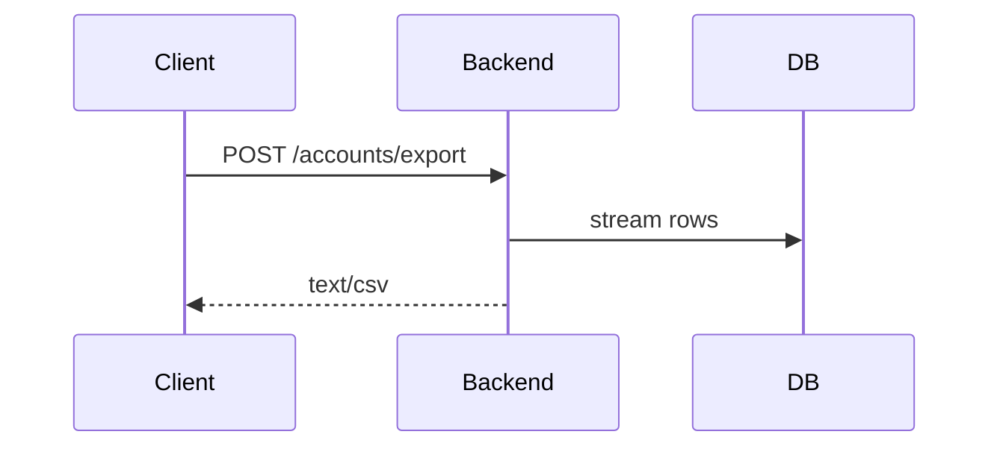

# Design

`## CONTEXT` stays change-local. Only `## Durable Design: <target>` sections are synced.

## CONTEXT

### Approaches Considered

| Approach | Trade-offs | Decision |
|---|---|---|
| `<preferred approach>` | `<why preferred>` | Accepted |
| `<alternative>` | `<why not>` | Rejected |

### Approach

- `<replace-me - the chosen approach, in enough detail that the durable edits below follow from it>`

### Key Decisions

| Decision | Alternatives considered | Rationale |
|---|---|---|
| `<replace-me>` | `<replace-me>` | `<replace-me>` |

<!-- NO DURABLE DESIGN IMPACT: delete everything below and leave the single line
     `No durable design impact.` -->

<!-- EXAMPLE START - DELETE THIS WHOLE BLOCK. Real sections go below EXAMPLE END.

## Durable Design: openspec/designs/architecture.md

### ADDED

#### Account export pipeline

The export pipeline streams account rows to a CSV encoder behind the dual-control gate.

### MODIFIED

#### Authentication

(Quote the durable doc's existing heading exactly, then give the content the sync should apply.
Preserve unrelated content in the durable doc.)

### REMOVED

#### Legacy export adapter

**Reason**: Superseded by the export pipeline above.

EXAMPLE END - DELETE EVERYTHING BETWEEN THE MARKERS. -->

<!-- Real `## Durable Design: <openspec/designs/...>` sections below, one per target the proposal
     named, each using only the ADDED / MODIFIED / REMOVED subsections it needs. Flow, sequence,
     and state diagrams MUST be Mermaid. -->
